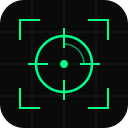

<p align="center">
  
</p>

<h1 align="center">Command Center</h1>

<p align="center">
  <strong>Your personal operations hub — tasks, habits, dailies, and automation.</strong>
</p>

<p align="center">
  <a href="#quick-start">Quick Start</a> •
  <a href="#features">Features</a> •
  <a href="#api">API</a> •
  <a href="#automation">Automation</a> •
  <a href="#stack">Stack</a> •
  <a href="#contributing">Contributing</a>
</p>

<p align="center">
  
  
  
  
  
  
</p>

<p align="center">
  
  
  
  
  
  
</p>

---

## What is Command Center?

Command Center is a **local-first personal operations app** built for developers who want to own their productivity stack. It combines kanban task management, habit tracking, daily routines, and automation — all with optional Habitica sync.

No cloud dependency. No subscription. Your data lives in a SQLite file on your machine.

### 🤖 Built for AI Agents

Command Center is **agent-agnostic** — designed from the ground up to be controlled by AI agents, not just humans. Any agent that can make HTTP requests or run shell commands can manage your entire productivity workflow.

<table>
<tr>
<td width="33%">

**Hermes Agent**
```bash
npm run mc -- list --json
npm run mc -- add "Ship feature"
npm run mc -- done 42
```
Native CLI integration.

</td>
<td width="33%">

**Any Agent (HTTP)**
```bash
curl localhost:3000/api/tasks
curl -X POST localhost:3000/api/tasks \
  -d '{"title":"Task"}'
```
REST API — works with any agent.

</td>
<td width="33%">

**CLI Agents**
```bash
# OpenClaw, AutoClaw, Codex, etc.
curl http://host:3000/api/tasks
```
Remote access for distributed agents.

</td>
</tr>
</table>

**Why agent-native?**
- Your agent manages your tasks while you sleep
- Automated daily standups, habit scoring, and routine completion
- Agents can create, update, complete, and query tasks programmatically
- No GUI required — full functionality via API and CLI
- Multiple agents can collaborate on the same task board

<br/>

<p align="center">
  <em>Think: Notion meets Habitica, but local, API-first, and built for agents.</em>
</p>

---

## Quick Start

### Docker (Recommended)

```bash
git clone https://github.com/jvbalcita/command-center.git
cd command-center
docker compose up -d
```

Open **http://localhost:3000** — that's it.

### Manual Setup

```bash
git clone https://github.com/jvbalcita/command-center.git
cd command-center
npm install
npm run db:push
npm run dev
```

Open **http://localhost:3000**.

---

## Features

<table>
<tr>
<td width="50%">

### 📋 Kanban Board
Drag-and-drop task management with projects, priorities, and due dates. Organize work by project or keep it in Inbox.

### 🔄 Habits & Dailies
Track habits with up/down scoring. Dailies with streaks, frequency scheduling, and completion tracking.

### 🤖 Automation
Time-based and event-triggered rules. Auto-complete tasks, auto-score habits, run custom actions on schedule.

</td>
<td width="50%">

### 🎮 Habitica Sync
Two-way sync with Habitica for tasks, habits, and dailies. Your Command Center stays in sync with your RPG productivity game.

### 📊 Dashboard
Activity feed, completion stats, and Habitica character stats at a glance.

### ⚡ Command Bar
Quick task creation with natural language parsing. Type what you need, hit enter.

</td>
</tr>
</table>

---

## API

Command Center exposes a **REST API** for programmatic access. Perfect for Hermes Agent, cron jobs, git hooks, and external tools.

### Endpoints

| Endpoint | Method | Description |
|----------|--------|-------------|
| `/api/tasks` | `GET` | List all tasks |
| `/api/tasks` | `POST` | Create a task |
| `/api/tasks/[id]` | `GET` | Get a task |
| `/api/tasks/[id]` | `PATCH` | Update a task |
| `/api/tasks/[id]/complete` | `POST` | Complete a task |
| `/api/dailies` | `GET` | List all dailies |
| `/api/dailies/[id]/complete` | `POST` | Complete a daily |
| `/api/habits` | `GET` | List all habits |
| `/api/habits/[id]/score` | `POST` | Score a habit |
| `/api/activity` | `GET` | Activity log |
| `/api/stats` | `GET` | Dashboard stats |
| `/api/automation/rules` | `GET` | List automation rules |
| `/api/automation/rules` | `POST` | Create automation rule |

### Examples

```bash
# List all tasks
curl http://localhost:3000/api/tasks

# Create a high-priority task
curl -X POST http://localhost:3000/api/tasks \
  -H "Content-Type: application/json" \
  -d '{"title": "Ship feature X", "priority": "high", "notes": "Ship the new dashboard"}'

# Complete a task
curl -X POST http://localhost:3000/api/tasks/1/complete

# Score a habit up
curl -X POST http://localhost:3000/api/habits/5/score \
  -H "Content-Type: application/json" \
  -d '{"direction": "up"}'

# Get dashboard stats
curl http://localhost:3000/api/stats
```

### Authentication

By default, the API is open when `API_SECRET` is not set. To enable token-based auth:

```bash
# Generate a secret
openssl rand -hex 32

# Add to .env
API_SECRET=your-generated-secret

# Use in requests
curl -H "Authorization: Bearer your-secret" http://localhost:3000/api/tasks
```

---

## Automation

Create rules that fire on schedule or when events happen.

### Rule Types

| Trigger | Action | Example |
|---------|--------|---------|
| Time-based | Complete task | Auto-complete daily standup every weekday at 9am |
| Time-based | Score habit | Auto-score "Exercise" up every Monday |
| Event-based | Notify | Alert when a task is overdue |
| Event-based | Sync | Push completed task to external service |

### Create a Rule

```bash
curl -X POST http://localhost:3000/api/automation/rules \
  -H "Content-Type: application/json" \
  -d '{
    "name": "Daily Standup",
    "trigger": "schedule",
    "schedule": "0 9 * * 1-5",
    "action": "complete_task",
    "targetId": 42
  }'
```

---

## Project Structure

```
src/
├── app/
│   ├── api/                 # REST API routes
│   ├── automation/          # Automation rules page
│   └── page.tsx             # Main kanban board
├── components/              # Shared UI components
│   ├── kanban-board.tsx     # Drag-and-drop board
│   ├── habit-card.tsx       # Habit display + scoring
│   ├── daily-card.tsx       # Daily routine card
│   └── command-bar.tsx      # Quick task creation
├── hooks/                   # Custom React hooks
└── lib/
    ├── automation/          # Rule engine & actions
    ├── db/
    │   ├── schema.ts        # Drizzle schema
    │   ├── queries.ts       # Database queries
    │   └── migrations/      # SQL migrations
    ├── habitica/            # Habitica API client & sync
    └── actions.ts           # Server actions
```

---

## Stack

| Layer | Technology |
|-------|-----------|
| Framework | Next.js 16 (App Router) |
| UI | React 19, shadcn/ui, Tailwind CSS 4 |
| Drag & Drop | dnd-kit |
| Icons | Hugeicons |
| Database | SQLite (better-sqlite3) |
| ORM | Drizzle ORM |
| Validation | Zod |
| Testing | Vitest |
| Language | TypeScript 5.7 |

---

## Development

```bash
# Start dev server
npm run dev

# Run tests
npm run test

# Type check
npm run typecheck

# Lint
npm run lint

# Build for production
npm run build

# Database operations
npm run db:push        # Push schema changes
npm run db:migrate     # Run migrations
npm run db:studio      # Open Drizzle Studio
npm run db:seed        # Seed demo data
```

---

## Environment Variables

| Variable | Description | Default |
|----------|-------------|---------|
| `DATABASE_URL` | SQLite database path | `./data/mission-control.db` |
| `API_SECRET` | Bearer token for API auth | _(open access)_ |
| `HABITICA_USER_ID` | Habitica user ID | — |
| `HABITICA_API_TOKEN` | Habitica API token | — |

Copy `.env.example` to `.env` and fill in your values.

---

## How Command Center Fits

Command Center is the **operations backbone** for a broader system. It's designed to be:

- **API-first** — Every feature is accessible via REST API
- **Agent-friendly** — Hermes Agent uses the CLI (`npm run mc`) and HTTP API to manage tasks
- **Automation-ready** — Rules engine for time-based and event-triggered actions
- **Sync-capable** — Two-way Habitica integration for RPG-style productivity

```
┌─────────────────────────────────────────────────────┐
│                  Command Center                      │
│                                                      │
│  ┌──────────┐  ┌──────────┐  ┌──────────┐          │
│  │  Tasks   │  │ Habits   │  │ Dailies  │          │
│  │ (Kanban) │  │ (Score)  │  │ (Streak) │          │
│  └────┬─────┘  └────┬─────┘  └────┬─────┘          │
│       │              │              │                │
│       └──────────────┼──────────────┘                │
│                      │                               │
│              ┌───────┴───────┐                       │
│              │  REST API     │                       │
│              └───────┬───────┘                       │
│                      │                               │
└──────────────────────┼──────────────────────────────┘
                       │
          ┌────────────┼────────────┐
          │            │            │
     ┌────┴────┐  ┌────┴────┐  ┌───┴────┐
     │ Hermes  │  │Cron Jobs│  │ Webhooks│
     │  Agent  │  │         │  │         │
     └─────────┘  └─────────┘  └─────────┘
```

---

## Contributing

Contributions welcome! Here's how:

1. Fork the repository
2. Create a feature branch (`git checkout -b feat/amazing-feature`)
3. Commit your changes (`git commit -m 'feat: add amazing feature'`)
4. Push to the branch (`git push origin feat/amazing-feature`)
5. Open a Pull Request

### Commit Convention

This project uses [Conventional Commits](https://www.conventionalcommits.org/):

- `feat:` — New feature
- `fix:` — Bug fix
- `docs:` — Documentation changes
- `refactor:` — Code refactoring
- `test:` — Adding tests
- `chore:` — Maintenance tasks

---

## License

MIT © [Command Center Contributors](LICENSE)

---

<p align="center">
  <sub>Built with ☕ and ⚡ by developers, for developers.</sub>
</p>
